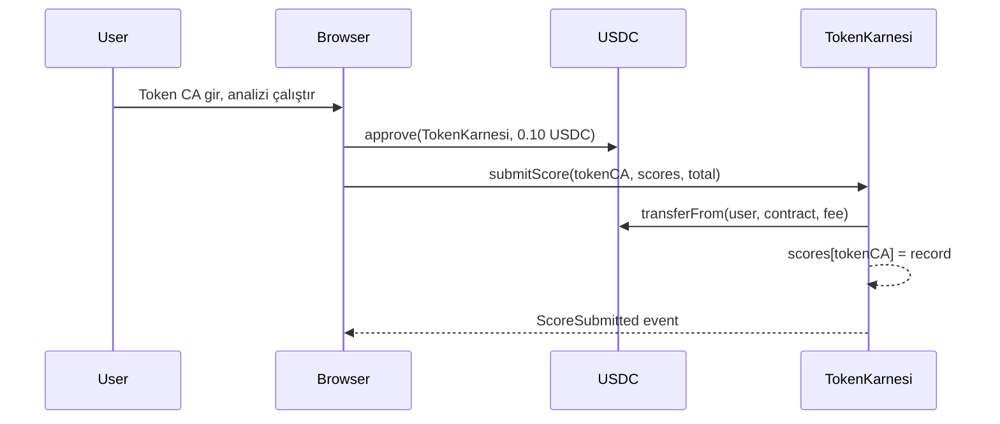

# TokenKarnesi Smart Contract — Design Doc

**Status:** Draft  
**Author:** Arc Studio  
**Target Chain:** Arc Testnet (ARC-TESTNET)  
**Language / Toolchain:** Solidity 0.8.x, Foundry  
**Milestone:** v1.0 — Testnet Deploy  

**Review Tracker:**
- [ ] Design Review
- [ ] Security Review
- [ ] Ops Review

---

## Action Items (living)

_(Boş — ilk taslak)_

---

## 1. Goals / Non-Goals

### Goals
- Herhangi bir kullanıcı, **0.10 USDC** ödeyerek bir token adresi için karne skoru kayıt edebilsin.
- Skor (12 sorunun her birinin 0/1 değeri + toplam puan) **zincirde kalıcı** olarak saklanasın.
- Daha önce kaydedilmiş skorlar herkes tarafından **ücretsiz** okunabilsin.
- Toplanan USDC **owner**'a çekilebilsin.
- Owner, USDC fiyatını ileride güncelleyebilsin.

### Non-Goals
- Off-chain analiz yapmak (bu frontend'in + DexScreener/GoPlus API'lerinin işi).
- Skor doğruluğunu zincir içinde doğrulamak.
- NFT veya token basmak.
- Yükseltme (upgradeable proxy) yok; ilk versiyonda sabit mantık yeterli.

---

## 2. Requirements

### Fonksiyonel
- `submitScore(address tokenCA, uint8[12] scores, uint8 total)` → 0.10 USDC ödeme alır, skoru saklar, event fırlatır.
- `getScore(address tokenCA)` → son kaydedilen `ScoreRecord` döner.
- `withdraw()` → owner birikmiş USDC'yi çeker.
- `setFee(uint256 newFee)` → owner ücret günceller.
- Aynı token için tekrar skor gönderilebilir; en son skor öncekinin üzerine yazar.

### Güvenlik
- `submitScore` çağrısından önce caller, USDC `approve` etmiş olmalı.
- `withdraw` ve `setFee` sadece owner çağırabilir.
- USDC transferi için `SafeERC20` kullanılacak.
- Herhangi bir reentrancy riski kapatılacak (CEI + `nonReentrant`).
- Sıfır-adres kontrolü: `tokenCA` sıfır adres olamaz.
- `scores` dizisinde her eleman 0 veya 1 olmalı; `total` 0–12 aralığında olmalı.

---

## 3. Terminology & Actors

| Aktör | On/Off-chain | Güven Seviyesi | Yapabilecekleri |
|---|---|---|---|
| **Owner** | On-chain (adres) | Güvenilir | withdraw, setFee |
| **User / Caller** | Off-chain | Güvenilmez | submitScore (ücret ödeyerek) |
| **Reader** | Off-chain | Güvenilmez | getScore (ücretsiz) |
| **USDC Contract** | On-chain | Güvenilir | ERC-20 transferFrom |

---

## 4. Language / Runtime

- **Solidity** `^0.8.20`, sabit pragma.
- **Foundry** (Forge) derleme ve test.
- **EVM hardfork:** Paris (`foundry.toml` ile sabit, Arc Testnet uyumlu).
- **OpenZeppelin 5.1.0** — `Ownable2Step`, `ReentrancyGuard`, `SafeERC20` kullanılacak.
- Cancun-only opcode gerektiren (`mcopy`) OZ 5.2.0+ dosyaları kullanılmayacak.

---

## 5. Transaction & Execution Model

İşlemler atomik. `submitScore` için akış:
1. `transferFrom(msg.sender, address(this), fee)` — USDC alınır.
2. Skor state'e yazılır.
3. Event fırlatılır.

CEI (Checks-Effects-Interactions) uygulanacak: kontroller önce, state yazımı ortada, dış çağrı sonda. `nonReentrant` modifier ek koruma sağlar.

---

## 6. Chain Standards & Interfaces

- ERC-20 (USDC) ile `SafeERC20.safeTransferFrom` üzerinden etkileşim.
- Özel token standardı yok; contract bir kayıt defteri niteliğinde.

**Arc Testnet USDC adresi:** `0x3c499c542cEF5E3811e1192ce70d8cC03d5c3359` değil — Arc Testnet'te doğru adres deployment öncesi onchain-facts'ten alınacak.

---

## 7. Architecture Overview



**Fon akışı:**

| Adım | Kim taşır | Ne taşır | İnvariant |
|---|---|---|---|
| 1 | User → Contract | `fee` USDC | `transferFrom` başarılı olmalı |
| 2 | Contract → Owner (withdraw) | Birikmiş USDC | `balanceOf(contract)` sıfırlanır |

**Dinlenme-durumu invariantı:** Contract, withdraw çağrılmadıkça bekleyen ücretleri tutar. Withdraw sonrası `balanceOf(address(this)) == 0`.

---

## 8. Contract Design

### Roller

| Rol | Sahip | Yetkiler | Neden |
|---|---|---|---|
| `owner` | Deploy edenin adresi | `withdraw`, `setFee` | Ücret ve para çekimi kontrolü |
| (herkes) | — | `submitScore`, `getScore` | Açık kayıt |

### Storage Layout

```solidity
struct ScoreRecord {
    address submitter;   // skoru gönderen adres
    uint8[12] scores;    // her sorunun cevabı (0 veya 1)
    uint8 total;         // toplam puan (0-12)
    uint64 timestamp;    // blok zamanı
}

mapping(address => ScoreRecord) public scores;  // tokenCA => son skor
uint256 public fee;                              // submitScore için USDC miktarı (6 decimals)
address public immutable usdc;                  // USDC ERC-20 adresi
```

`Ownable2Step` + `ReentrancyGuard` inherit edilir.

### Modifiers

| Modifier | Koşul |
|---|---|
| `onlyOwner` | `msg.sender == owner` |
| `nonReentrant` | Reentrant çağrıyı bloklar |

### Fonksiyonlar (WRITE)

| İmza | Çağıran | State Değişikliği | Event | Revert Koşulları |
|---|---|---|---|---|
| `submitScore(address tokenCA, uint8[12] scores, uint8 total)` | Herkes | `scores[tokenCA]` güncellenir, USDC alınır | `ScoreSubmitted` | `tokenCA == address(0)`, herhangi `score > 1`, `total > 12`, `transferFrom` başarısız |
| `withdraw()` | Owner | USDC bakiyesi owner'a transfer edilir | `Withdrawn` | Bakiye sıfır |
| `setFee(uint256 newFee)` | Owner | `fee` güncellenir | `FeeUpdated` | — |

### Events

| Event | Parametreler | Ne zaman |
|---|---|---|
| `ScoreSubmitted(address indexed tokenCA, address indexed submitter, uint8 total, uint64 timestamp)` | tokenCA, submitter, total, timestamp | Her başarılı `submitScore` |
| `Withdrawn(address indexed to, uint256 amount)` | to, amount | Her başarılı `withdraw` |
| `FeeUpdated(uint256 oldFee, uint256 newFee)` | oldFee, newFee | Her `setFee` |

---

## 9. Deployment & Initialization

- Constructor argümanları: `address _usdc`, `uint256 _initialFee`, `address _initialOwner`
- `_initialOwner` → `Ownable2Step` ile set edilir.
- `_initialFee` → 100000 (0.10 USDC, 6 decimals).
- Constructor'da sıfır-adres kontrolü: `_usdc != address(0)`, `_initialOwner != address(0)`.
- Testnet deploy: Mode 1 (`deploy_contract` tool), Arc Testnet.

---

## 10. Upgradeability

Yok. İmmutable contract. Değişiklik gerekirse yeni adrese deploy + frontend yönlendirmesi yeterli. Toplanan fonların taşınması için `withdraw` yeterli.

---

## 11. Key Management & Signing

- `owner` rolü: deploy eden cüzdan (Arc Studio platform cüzdanı, testnet için).
- Off-chain imza yok; EIP-712 gerekmez.

---

## 12. Security Considerations

| Zafiyet | Uygulanır mı? | Mitigasyon |
|---|---|---|
| Reentrancy | Evet (`submitScore`, `withdraw` dış çağrı yapar) | CEI + `nonReentrant` |
| Access Control | Evet (`withdraw`, `setFee`) | `onlyOwner` (Ownable2Step) |
| Integer overflow/underflow | Solidity ≥0.8 otomatik | `unchecked` blok yok |
| Unchecked external call | Evet (USDC transferFrom) | `SafeERC20.safeTransferFrom` |
| Fee-on-transfer token | Hayır (USDC standarttır) | N/A |
| Signature replay | Hayır (imza yok) | N/A |
| Front-running / MEV | Düşük risk (sabit ücret, kayıt işlemi) | N/A |
| Flash-loan / price manipulation | Hayır (oracle kullanılmıyor) | N/A |
| Denial of service | Düşük risk | Pull-over-push (withdraw) |
| Delegatecall / proxy safety | Hayır (upgradeable değil) | N/A |
| Timestamp dependence | Evet (`timestamp` kaydediliyor) | Sadece kayıt amaçlı, güvenlik kararı için kullanılmıyor |
| Approval persistence | Evet (user approve eder) | Exact-amount approval önerilecek |
| Centralization risk | Evet (`owner` her şeyi kontrol eder) | Testnet için kabul edilebilir; mainnet'te multisig önerilir |
| Sıfır adres | Evet | Constructor + submitScore'da kontrol |
| Geçersiz skor değeri | Evet | `score[i] <= 1` ve `total <= 12` kontrolü |

---

## 13. Trust Model & Threat Analysis

| Aktör | Ele geçirilirse max hasar | Mitigasyon |
|---|---|---|
| **Owner key** | Tüm birikmiş USDC çekilebilir, fee değiştirilebilir | Testnet: kabul. Mainnet: multisig + timelock önerilir |
| **User** | Kendi USDC'sini kaybeder (fee öder), sahte skor yazar (verifikasyon off-chain) | Skor doğruluğu zincir içinde garanti edilmiyor — bu tasarım kararı |

---

## 14. Emergency Response

- Pause mekanizması yok (basit contract, düşük risk).
- Acil durumda: yeni contract deploy et, frontend'i yönlendir, eski contract'tan `withdraw` yap.

---

## 15. Failure Scenarios

- **USDC transferFrom başarısız:** tx revert, skor yazılmaz. Kullanıcı approve etmemişse açık hata mesajı.
- **Withdraw'da bakiye sıfır:** revert, owner bilgilendirilir.
- **tokenCA sıfır adres:** revert, hiçbir state değişikliği olmaz.
- **Geçersiz score değeri:** revert.

---

## 16. Testing Strategy

- **Unit testler (Foundry):** happy path, revert path, event kontrolü, fuzz (fee, score değerleri).
- **Slither:** statik analiz, tüm High/Medium bulgular ele alınacak.
- **Integration test (post-deploy):** her fonksiyon gerçek zincir state'ine karşı test edilecek.
- Komut: `cd /home/user/app && forge test --gas-report`

---

## 17. Third-Party Libraries

| Lib | Versiyon | Zaten bağımlılık? | Neden | Security review? |
|---|---|---|---|---|
| OpenZeppelin Contracts | 5.1.0 | Evet (sandbox'ta sabit) | Ownable2Step, SafeERC20, ReentrancyGuard | Evet (OZ tarafından) |

---

## 18. Common Patterns / Worked Example

**Kullanıcı skor kaydeder:**

1. Frontend, DexScreener/GoPlus'tan 12 soruyu analiz eder → `scores = [1,1,0,1,1,1,0,1,1,0,1,0]`, `total = 8`
2. Kullanıcı `USDC.approve(TokenKarnesi, 100000)` imzalar
3. Kullanıcı `TokenKarnesi.submitScore("0xTokenCA...", scores, 8)` çağırır
4. Contract: `transferFrom(user, contract, 100000)` → bakiye güncellenir
5. Contract: `scores["0xTokenCA..."] = ScoreRecord{submitter, scores, 8, block.timestamp}`
6. Event: `ScoreSubmitted("0xTokenCA...", user, 8, timestamp)`
7. Frontend event'i dinler, "Skor zincire kaydedildi!" gösterir
